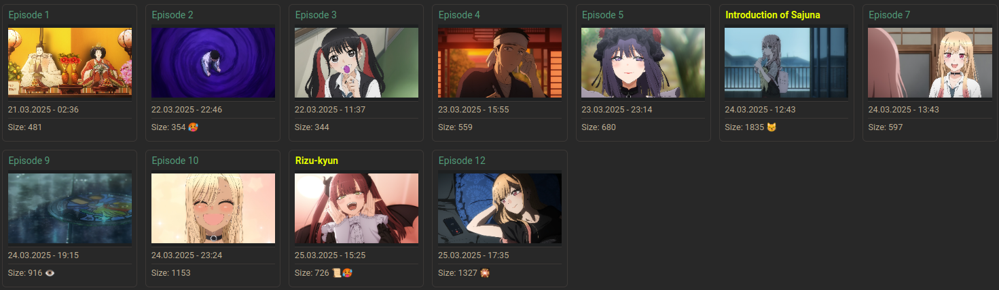

# gameinit 
Scripts to capture video game material seamlessly into obsidian notes.

Obsidian md file requires YAML property "launch" where the command line launch command for the game is inserted.
Games are launched with:

Dependencies:
- graphicsmagick
- scrot
- xprintidle

# anime-starter 

Dependencies: 
- mpv
- mpv-cut plugin
- socat 
- inotify-tools 

## Usage 
Put "animepath" property inside your yaml with the absolute path of the anime inside it. That's it. 

Dataview insert can be edited in ~/.config/ortscripts/anime-dataview-insert

## Features 
- fzf search for all animepath anime 
- -i flag for history feature 
- give number as argument to launch the episode directly 
- automatically tracks your completion status 
- unique title with "title" property
- only increases episode count if episode is actually completed (85% completion)
- tracks when an episode was not completed and opens it again at the exact time it was closed
- automatically tracks rewatches 
- automatic dataview creation with individual files for each episode 
- automatic thumbnail generation 
- replace thumbnail any time with your own screenshot 
- delete cover-img property to insert a new thumbnail for your next screenshot 
- screenshot support and auto insertion with s key 
- video clip support and insertion with c c (mpv-cut plugin)

# Special yaml properties:
## cut: x y 
Takes two numbers that represent pixels that get cut off the side. First number is horizontal pixels, second number is vertical. Both numbers have to be filled, use 0 when you don't want to cut anything for a side. 
## hook-values: x y 
Takes two numbers. First replaces the hook counter, the seconds it takes to hook the first process. Second replaces the start up compensator. Both have to be filled. Use 0 when you want to keep using the default value. 

